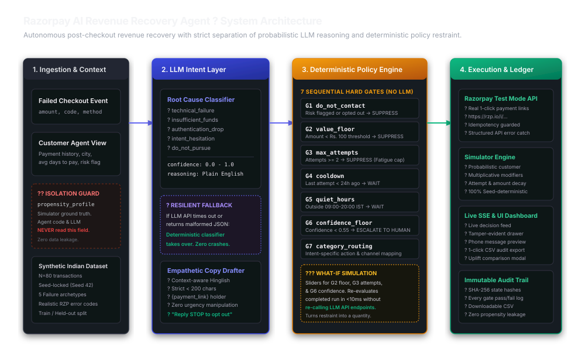

# Razorpay AI Revenue Recovery Agent
> **Track 3 ? Autonomous Post-Checkout Revenue Recovery**



---

## 1. What This Is

**Razorpay Optimizer recovers payments inside the active checkout session through dynamic routing, smart retries, and gateway downtime mitigation. This agent recovers revenue *after* the session has failed and the customer has abandoned checkout.** By combining LLM-powered root-cause failure diagnosis with a strictly deterministic 7-gate policy engine, the agent autonomously orchestrates personalized, fatigue-safe recovery workflows generating real 1-click Razorpay test payment links.

---

## 2. Benchmark Results & Uplift Table

Evaluated on the standardized Indian checkout failure cohort ($N=80$ transactions, Master Seed `42`):

| Evaluation Metric | Autonomous AI Agent | Zero-Intervention Baseline | Net Lift / Delta |
| :--- | :---: | :---: | :---: |
| **Total Processed Cohort** | $80$ transactions | $80$ transactions | Identical cohort ($N=80$) |
| **Gross Value at Risk** | $\text{Rs. } 4,18,187.00$ | $\text{Rs. } 4,18,187.00$ | ? |
| **Recovered Transactions** | **$31$ payments** | $9$ payments | **$+22$ payments** ($+244.4\%$) |
| **Recovery Rate** | **$38.8\%$** | $11.2\%$ | **$+27.6\%$ net lift** ($3.46\times$ relative) |
| **Recovered Revenue** | **$\text{Rs. } 1,37,669.00$** | $\text{Rs. } 86,791.00$ | **$+\text{Rs. } 50,878.00$ net uplift** |
| **Deliberately Suppressed** | **$24$ transactions** | $0$ (Unmanaged) | **$\text{Rs. } 1,25,456.00$ protected** |
| **Outreach Contacts Sent** | $84$ messages | $0$ messages | $\text{Rs. } 42.00$ total spend |
| **Cost Per Recovery** | **$\text{Rs. } 1.35$** | $\text{Rs. } 0.00$ | WhatsApp / SMS Business API |
| **Net ROI Multiplier** | **$1,211\times$ ROI** | N/A | $\text{Net Revenue} / \text{Outreach Cost}$ |

---

## 3. What is Real and What is Simulated

To ensure transparency and rigorous evaluation, the system maintains strict boundaries between real infrastructure and simulated components:

| Component | Status | Details |
| :--- | :---: | :--- |
| **Razorpay API Integration** | **REAL** | Real API calls to Razorpay Test Mode creating genuine 1-click payment links (`https://rzp.io/i/...`) with structured error handling and idempotency guards keyed on `reference_id`. |
| **LLM Classification & Drafting** | **REAL** | Real completions via configured LLM provider (`gemini-2.0-flash`) with structured schema validation and automatic fallback to rule-based classification on API failure. |
| **Policy Engine & Gates** | **REAL** | $100\%$ deterministic Python logic evaluating 7 hard sequential gates without external LLM calls. |
| **Checkout Dataset** | **SYNTHETIC** | Synthetic dataset of $N=80$ failed transactions calibrated against empirical Indian e-commerce error distributions (UPI gateway timeouts, 3DS authentication drops, insufficient funds, checkout hesitation). |
| **Customer Response** | **SIMULATED** | Deterministic, seed-isolated simulation of buyer behavior based on 5 propensity archetypes (`reliable`, `distracted`, `hesitant`, `broke`, `ghost`) and multiplicative fatigue modifiers. **The agent code and LLM never have access to this private ground-truth field.** |

---

## 4. Safety & Restraint: What Was Deliberately Not Pursued

The core argument of this project is **judgment under restraint**. The system treats policy suppressions with equal importance to successful recoveries:

* **$24$ transactions ($30.0\%$ of the cohort) were deliberately suppressed by policy gates**, holding back $\text{Rs. } 1,25,456.00$ from unhelpful or harmful outreach.

### The 7 Deterministic Hard Gates
1. **$G1$ `do_not_contact`**: Permanent suppression for accounts with risk flags or previous outreach opt-outs (e.g. `pay_1006` held back due to dispute risk).
2. **$G2$ `value_floor`**: Suppresses outreach if cart amount $< \text{Rs. } 100.00$ (cost of WhatsApp/SMS contact exceeds expected recovery margin).
3. **$G3$ `max_attempts`**: Non-bypassable cap of 2 contact attempts per transaction to eliminate spam and fatigue.
4. **$G4$ `cooldown`**: Mandatory 24-hour spacing between consecutive recovery contacts.
5. **$G5$ `quiet_hours`**: Blocks outreach outside $09:00 - 20:00\text{ IST}$ daytime window.
6. **$G6$ `confidence_floor`**: Escalates cases with classification confidence $< 55\%$ to human customer support.
7. **$G7$ `category_routing`**: Delays outreach for `insufficient_funds` by 48 hours to align with salary and account reload cycles.

---

## 5. Quickstart Guide

### Prerequisites
- Python 3.10+ (tested on Python 3.13)
- Node.js 18+ and npm
- (Optional) Razorpay Test Keys and Gemini/LLM API Key

### Backend Setup
```bash
# 1. Clone repository
git clone https://github.com/Harshit-OO7/recovery-agent.git
cd recovery-agent/backend

# 2. Create virtual environment
python -m venv venv
# Windows:
.\venv\Scripts\activate
# macOS/Linux:
# source venv/bin/activate

# 3. Install dependencies
pip install -r requirements.txt

# 4. Configure environment variables (optional for test mode)
cp .env.example .env
# Edit .env to add RAZORPAY_KEY_ID, RAZORPAY_KEY_SECRET, and LLM_API_KEY
# If keys are omitted, system automatically operates with built-in mock clients and fallback classifiers.

# 5. Generate seed dataset
python -m app.data.seed

# 6. Run test suite with coverage
python -m pytest --cov=app --cov-report=term-missing

# 7. Start FastAPI server
uvicorn app.main:app --reload --port 8000
```
API Documentation will be live at: `http://localhost:8000/docs`

### Frontend Setup
```bash
# In a new terminal:
cd recovery-agent/frontend

# 1. Install dependencies
npm install

# 2. Run production build check
npm run build

# 3. Start development server
npm run dev
```
Dashboard will be live at: `http://localhost:5173`

---

## 6. Key Frontend Features

1. **Live Decision Feed**: Consumes Server-Sent Events (`/api/runs/{id}/stream`), animating transactions through `classifying -> decided -> outcome`.
2. **Interactive What-If Policy Sliders**: Adjust $G2$ Value Floor, $G3$ Max Attempts, and $G6$ Confidence Floor to re-evaluate policy restraint over completed cohorts in $<10\text{ms}$ without re-calling LLM APIs.
3. **Phone Message Preview**: Renders an authentic smartphone mockup displaying the exact drafted WhatsApp/SMS message with the live Razorpay test payment link.
4. **One-Click CSV Audit Export**: Single button in top bar and decision feed to download the complete immutable SHA-256 verified audit ledger.
5. **Controlled Failure Injection Mode**: Toggle in left rail to force an LLM provider JSON malformation on Payment #2, proving the system falls back to rule-based classification with 0 batch crashes.
6. **Side-by-Side Comparison Modal**: Inspect head-to-head metrics against the zero-intervention baseline on identical random seeds.
7. **Dark Mode**: High-contrast, dense instrument theme for low-light monitoring.

---

## 7. Honest Limitations

1. **Synthetic Cohort Sample Size**: The primary evaluation was conducted on a synthetic sample of $N=80$ transactions. While failure codes and reasons are modeled on real Razorpay production errors, customer propensity profiles are simulated.
2. **Static Channel Cost Assumption**: Assumes a flat $\text{Rs. } 0.50$ cost per contact attempt (reflecting standard WhatsApp Business API and transactional SMS rates in India). In production, rates vary by template category.
3. **Fixed Liquidity Delay**: A uniform 48-hour delay is used for insufficient funds; real-world deployment would benefit from dynamic salary cycle inference based on historical merchant transaction dates.

---

## 8. What I Would Build Next With Real Merchant Data

1. **Dynamic Salary Cycle Inference**: Analyze historical merchant payment patterns per city and industry to predict optimal payroll timing (e.g. 1st vs 5th of the month) for liquidity retry outreach.
2. **UPI Intent Deep Linking**: Generate direct `upi://pay` deep links configured with merchant VPA and transaction references, allowing 1-tap checkout recovery without leaving WhatsApp.
3. **Automated Dispute & Chargeback Feedback Loops**: Ingest webhook chargeback alerts directly into Gate $G1$ to instantly blacklist compromised customer identifiers across the merchant network.
4. **Hierarchical Bayesian Propensity Updating**: Continuously update customer propensity estimates across repeated merchant visits without exposing raw PII.

---

## 9. Documentation Directory

- [`docs/architecture.md`](docs/architecture.md): Complete module-by-module walkthrough, data flows, and reasoning on the separation of perception and policy.
- [`docs/decisions.md`](docs/decisions.md): Architectural decision log, evaluated alternatives, and rejection rationales.
- [`docs/results.md`](docs/results.md): Detailed pitch evaluation benchmarks and unit economics.
